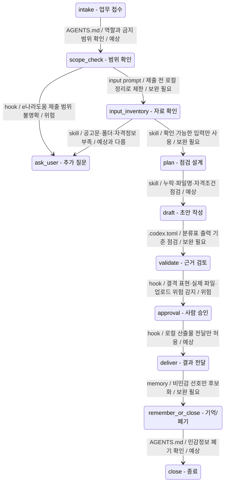

# 예시 01: 공공 지원사업 서류검토 에이전트 하네스 모델링

이 파일은 사용자가 00번 하네스 번역기에 아래 요구사항을 넣었을 때의 모델링 결과입니다. 기존의 같은 주제 예시는 삭제하고, 이번 요청만 기준으로 다시 작성했습니다.

사용자 요구사항:

```text
지원사업 서류검토 에이전트를 만들어 주세요.
제출서류 폴더와 공고문을 보고 누락 서류, 자격조건 불충족, 파일명 불일치를 점검해 주세요.
결과는 통과 / 보류 / 결격 분류표로 만들면 좋겠습니다.
가능하면 e나라도움 제출 직전 정리까지 해 주세요.
```

Public-safe 기준:

- 이 예시는 실제 공고문 원문, 제출 파일명 원문, 신청자 개인정보, 사업자등록번호, 재무자료, 인증정보를 포함하지 않습니다.
- e나라도움 제출 직전 정리는 `제출 전 로컬 점검표`와 `사람 승인 대기 목록`까지만 모델링합니다.
- 로그인, 업로드, 제출은 하네스 모델링 단계에서 자동화하지 않습니다.

## Mission

공공 지원사업 제출 전 검토를 위해, 사용자가 제공하는 공고문과 제출서류 폴더의 파일 목록을 대조하여 누락 서류, 파일명 불일치, 명시적으로 확인 가능한 자격조건 불충족 항목을 점검하고, 사람이 최종 확인할 수 있는 `통과 / 보류 / 결격 후보` 분류표와 e나라도움 제출 직전 로컬 정리 체크리스트를 만든다.

맡지 않는 일:

- e나라도움 또는 기관 포털에 자동 로그인하지 않습니다.
- 파일을 자동 업로드하거나 신청서를 제출하지 않습니다.
- 법률, 세무, 행정상 최종 결격 판정을 하지 않습니다.
- 누락 서류를 대신 작성하거나 허위 보완 방법을 제안하지 않습니다.
- 실제 제출 문서 원문, 개인정보, 사업자등록번호, 재무자료, 인증정보를 repo나 memory에 저장하지 않습니다.

## Scenario Readiness

| 항목 | 내용 |
|------|------|
| 판정 | 위험 |
| 이유 | 사용자가 원하는 업무는 분명하지만, 실제 제출서류 폴더 접근과 e나라도움 제출 직전 정리가 포함되어 있어 승인·민감정보·외부서비스 경계가 필요합니다. 입력 경계와 승인 지점 없이 바로 구현하면 위험합니다. |
| 지금 만들 수 있는 workflow 범위 | 하네스 상태 모델, 부족 정보 진단, 안전 규칙, 입력/출력 계약, dry-run 중심의 e나라도움 제출 직전 로컬 체크리스트 설계 |
| 지금 만들면 약한 workflow 단계 | `scope_check -> input_inventory`: 실제 폴더를 읽어도 되는지 불분명합니다. `validate -> approval`: 결격 표현과 제출 직전 정리 범위가 불분명합니다. |
| 사용자 설명 충분도 | 설명 보완 필요 |
| 사람 승인 없이는 막아야 할 행동 | 실제 폴더 접근, 문서 본문 추출, 개인정보 포함 파일 처리, e나라도움 로그인, 업로드, 제출, 외부 크롤링 |

## Persona Applied

이 모델링은 비개발자 사회인이나 대학생이 이해할 수 있도록 먼저 업무 흐름을 쉬운 말로 설명한 뒤, 필요한 하네스 용어를 붙입니다.

- `AGENTS.md`는 에이전트가 항상 지켜야 하는 업무 규칙표입니다.
- `skill`은 반복되는 점검 순서를 적어 둔 조리법입니다.
- `MCP`는 실제 폴더나 외부 서비스를 안전하게 다루는 연결 장치입니다.
- `hook`은 위험한 행동 전에 잠깐 멈추는 검문소입니다.
- `memory`는 다음에도 반복 설명하지 않기 위한 안전한 기억입니다.
- `subagent`는 큰 공고문이나 많은 파일을 나눠 검토하는 보조 작업자입니다.

## Request Interpretation

사용자는 공고문과 제출서류 폴더를 비교해서, 제출 전에 사람이 확인할 수 있는 서류검토 표를 만들고 싶은 것으로 보입니다. 단순히 파일 목록을 예쁘게 정리하려는 것이 아니라, 누락 서류, 파일명 불일치, 자격조건 위험 항목을 한 번에 보고 최종 제출 전에 놓친 부분을 줄이고 싶다는 요청입니다.

하지만 지금 요청만으로 에이전트를 바로 만들면 목적대로 작동하지 않을 수 있습니다. 제출서류 폴더가 실제 고객 문서인지 샘플인지, 에이전트가 폴더를 직접 읽어도 되는지, 자격조건을 판단할 신청자 정보가 어디에 있는지, `결격`을 최종 판정처럼 써도 되는지 아직 정해지지 않았기 때문입니다.

예를 들어 공고문에 지방세 완납이 필요하다고 적혀 있어도, 파일명만 보고 실제 완납 여부를 확인할 수는 없습니다. 이 상태에서 에이전트가 통과나 결격을 확정하면 사용자는 공식 판단처럼 오해할 수 있습니다. 그래서 부족한 항목은 통과가 아니라 보류 또는 확인 필요로 내려야 합니다.

또한 “e나라도움 제출 직전 정리”라는 표현은 로컬 체크리스트를 만들라는 뜻일 수도 있고, 실제 업로드 순서까지 준비하라는 뜻일 수도 있습니다. 이 차이가 정해지지 않으면 에이전트가 검토 도우미로 멈춰야 할지, 외부 서비스로 넘어가려 해야 할지 헷갈릴 수 있습니다.

따라서 지금 상태에서는 완성형 자동화가 아니라, 상태전이 다이어그램을 먼저 보고 어느 전이가 질문, 보류, 사람 승인으로 빠지는지 확인하는 것이 안전합니다.

## Plain-Language Gap Feedback

1. 제출서류 폴더를 실제로 읽어도 되는지 불분명합니다.
   그래서 에이전트가 사용자의 승인 없이 실제 파일명, 문서 구조, 개인정보가 들어 있는 폴더를 열어볼 수 있습니다.
   이 부분은 `hook`에 실제 폴더 접근 전 승인 검문소를 두고, `MCP` 계약에 읽기 범위를 명확히 적으면 보강됩니다.

2. 자격조건을 판단할 신청자 정보가 불분명합니다.
   그래서 에이전트가 파일 이름만 보고 “이 신청자는 지역, 업종, 체납, 매출 조건을 만족한다”고 착각할 수 있습니다.
   이 부분은 입력 프롬프트에 신청자 자격 정보 필드를 두고, 없으면 `보류`로 처리하는 `skill` 규칙을 넣으면 보강됩니다.

3. `결격`이 최종 탈락인지 내부 검토용 위험 표시인지 불분명합니다.
   그래서 에이전트가 사람이 확인하지 않은 내용을 최종 행정 판단처럼 말할 수 있습니다.
   이 부분은 `AGENTS.md`와 `hook`에 사람 검토 전에는 `결격 후보`로만 표현한다는 규칙을 넣으면 보강됩니다.

4. 파일명 불일치 기준이 불분명합니다.
   그래서 에이전트가 `사업계획서_최종.pdf`처럼 사람이 알아볼 수 있는 파일을 틀렸다고 과하게 잡거나, 반대로 `최종.pdf`처럼 너무 모호한 파일을 통과시킬 수 있습니다.
   이 부분은 `skill`에 권장 파일명, 허용 별칭, 불명확 파일명을 나누는 절차를 넣으면 보강됩니다.

5. “e나라도움 제출 직전 정리”의 범위가 불분명합니다.
   그래서 에이전트가 단순 체크리스트 작성까지만 해야 하는지, 업로드 순서 정리까지 해야 하는지, 실제 제출 화면 조작까지 해야 하는지 헷갈릴 수 있습니다.
   이 부분은 `.codex.toml`에 output을 `local_pre_submission_checklist`로 제한하고, 업로드·제출은 `hook`으로 차단하면 보강됩니다.

## Workflow State Map

| 상태 | 입력 | 출력 | 다음 상태 | 전이 조건 | 누락 정보 |
|------|------|------|-----------|-----------|-----------|
| intake | 사용자 요청 | 한 문장 mission, 맡지 않는 일 후보 | scope_check | 목표와 기대 출력이 확인됨 | 실제 사용자 역할 |
| scope_check | mission, e나라도움 요청, public-safe 규칙 | 금지 작업, 승인 지점, dry-run 범위 | input_inventory 또는 ask_user | 실제 제출/업로드는 제외하고 제출 전 정리로 제한 | e나라도움 정리 범위 |
| input_inventory | 공고문, 제출서류 폴더 경로 또는 파일 목록, 신청자 정보 | 필수 입력 목록, 민감 입력 목록, 누락 입력 목록 | plan 또는 ask_user | 자료 접근 승인과 최소 입력이 확인됨 | 실제 폴더 접근 승인, 자격정보 |
| ask_user | 누락된 필수 기준 | 보완 질문, 보류 사유 | input_inventory | 사용자가 입력 경계나 기준을 보완함 | 답변 전에는 계획 약함 |
| plan | 공고 요건, 파일 목록, 분류 라벨 | 점검 순서, 매핑 기준, 출력 스키마 | draft | 누락/파일명/자격조건 분기 기준이 있음 | 파일명 허용 규칙 |
| draft | 점검 계획, 제공된 입력 | 분류표 초안, 제출 직전 정리 초안 | validate | 각 행에 근거와 판정 사유가 있음 | 문서 본문 확인 가능 여부 |
| validate | 분류표 초안, 공고 근거, 파일 근거 | 보수적 분류표, 위험 표현 수정 | approval | 근거 없는 통과/결격이 제거됨 | 사람 검토 기준 |
| approval | 분류표, 위험 행동 목록 | 승인 대기 또는 로컬 전달 가능 판단 | deliver | 외부 제출/업로드가 승인 없이 실행되지 않음 | 승인자 |
| deliver | 검증된 분류표, 제출 전 체크리스트, 질문 목록 | markdown/json/csv 후보 산출물 | remember_or_close | public-safe 산출물만 남김 | 선호 출력 형식 |
| remember_or_close | 비민감 선호, 폐기 대상 | memory 후보와 저장 금지 목록 | close | 민감정보 저장 금지 기준 적용 | memory 사용 여부 |

## State Transition Diagram



## Unexpected Transition Notes

| 전이 | 사용자 예상 | 실제 설계 흐름 | 작동 부품 | 이유 | 부족 정보 |
|------|-------------|----------------|-----------|------|-----------|
| scope_check -> ask_user | “가능하면 e나라도움 제출 직전 정리”까지 자연스럽게 해 줄 것이라고 기대할 수 있습니다. | 제출 직전 정리가 업로드/제출을 뜻할 수 있어 먼저 질문 또는 승인 상태로 갑니다. | hook | 외부 제출은 위험 행동이므로 자동 실행하면 안 됩니다. | 정리 범위, 승인자 |
| input_inventory -> ask_user | 폴더와 공고문을 주면 바로 표가 나올 것이라고 기대할 수 있습니다. | 실제 폴더 접근 승인, 공고문 범위, 자격 정보가 부족하면 질문으로 돌아갑니다. | skill | 자격조건과 파일명 판정은 근거가 필요합니다. | 폴더 접근 승인, 자격정보 |
| input_inventory -> plan | 모든 서류와 자격조건이 확정 판정될 것이라고 기대할 수 있습니다. | 확인 가능한 항목만 계획하고, 근거 없는 항목은 보류로 둡니다. | skill | 파일 목록만으로 문서 발급일이나 체납 여부를 알 수 없습니다. | 문서 본문/메타데이터 |
| validate -> approval | 검토가 끝나면 바로 결격/통과가 확정될 것이라고 기대할 수 있습니다. | 최종 결격 표현, 실제 업로드, 제출은 사람 승인 상태로 이동합니다. | hook | 행정상 최종 판단과 제출 실행은 사람이 책임져야 합니다. | 결격 라벨 정의, 승인 기준 |

## Gap Impact Report

| 부족한 정보 | 약해지는 workflow 단계 | 에이전트가 빠질 수 있는 상황 | 사용자에게 생길 문제 | 보강할 부품 |
|-------------|------------------------|------------------------------|----------------------|-------------|
| 실제 폴더 접근 승인 | scope_check -> input_inventory | 승인 없이 실제 제출 폴더를 읽음 | 개인정보·민감문서 노출 위험 | hook, MCP, `.codex.toml` |
| 신청자 자격 정보 | input_inventory -> plan | 파일명만 보고 자격조건을 추정함 | 잘못된 통과/결격 후보 분류 | input prompt, skill |
| 결격 라벨 정의 | plan -> draft | 내부 검토용 후보를 최종 결격처럼 표현함 | 행정 판단으로 오해 | `AGENTS.md`, hook |
| 파일명 허용 규칙 | draft -> validate | 허용 가능한 파일명을 불일치로 잡거나 모호한 파일을 통과시킴 | 불필요한 수정 또는 누락 위험 | skill |
| e나라도움 제출 직전 정리 범위 | validate -> approval | 실제 업로드나 제출 조작까지 시도함 | 승인 없는 외부 행동 위험 | hook, `.codex.toml`, MCP |
| 출력 형식 | approval -> deliver | 표는 만들지만 제출 직전 확인에 바로 쓰기 어려움 | 사람이 다시 정리해야 함 | `.codex.toml`, `AGENTS.md` |

## HTML Analysis View

| 항목 | 내용 |
|------|------|
| 파일 | `examples/01-public-grant-document-review-analysis-view.html` |
| 목적 | 사용자의 요청이 어떤 상태에서 질문·보류·승인으로 흐르는지 시각화 |
| 포함 내용 | Mermaid 상태전이 다이어그램, 예상과 다른 전이, gap, 보강할 하네스 부품, 질문 |
| public-safe 조건 | 실제 공고문 원문, 제출 파일명 원문, 개인정보, 인증정보를 넣지 않음 |

## Harness Parts

| 부품 | 입력 | 출력 | 실패 모드 | 불변식 |
|------|------|------|-----------|--------|
| 시스템 프롬프트 | 공고 요건, 파일 목록, 신청자 정보, 안전 규칙 | 보수적 검토 결과와 분류표 | 역할 범위 초과, 확정 판정 과잉, 원문 저장 | 근거 없는 통과/결격 금지. 제출/업로드 자동 실행 금지. |
| 입력 프롬프트 | 사업명, 공고문, 제출서류 폴더 또는 파일 목록, 신청자 자격 정보, 제출 직전 정리 범위 | 실행별 점검 파라미터 | 필수 입력 누락, 파일명 기준 모호, 승인 경계 없음 | 필수 입력이 없으면 질문하거나 보류로 표시합니다. |
| memory | 비민감 출력 선호, 표 컬럼 선호, 반복 체크포인트 | 다음 작업에 선택적으로 주입할 선호 | 오래된 기준 재사용, 민감정보 저장 | 실제 공고 원문, 제출 문서 원문, 개인정보, 인증정보는 저장하지 않습니다. |
| skill | 공고 요건 추출, 파일명 매핑, 자격조건 점검, 제출 전 체크리스트 작성 절차 | 요건 대응표와 판정 규칙 | 요건 타입 혼동, 파일명 과잉 매칭, 오래된 절차 | 불확실하면 `보류` 또는 `확인 필요`로 낮춥니다. |
| MCP | 향후 승인된 로컬 파일 목록화, 문서 텍스트 추출, e나라도움 dry-run 후보 | 파일명/메타데이터/추출 결과 또는 실패 사유 | 파일 없음, 권한 없음, 텍스트 추출 실패, 인증 실패 | 신뢰 경계 밖 자원은 승인 없이 접근하지 않습니다. |
| subagent | 긴 공고문, 많은 파일 목록, 독립 자격조건 검토 | 요건 추출, 파일 매핑, 자격 점검 결과 | 기준 불일치, 컨텍스트 누수, 자식 결과 과신 | 부모가 근거와 판정을 최종 검증합니다. 재귀 깊이는 1로 제한합니다. |
| hook | 실제 파일 접근 전, 외부 행동 전, 최종 답변 전 | 허용/차단/승인 필요 판단 | hook 실패, 민감정보 탐지 누락 | hook 실패 시 안전하게 중단하고 사용자 확인을 요청합니다. |

## Reinforcement Plan

| 보강 부품 | 이유 | 적용 방향 |
|-----------|------|-----------|
| `AGENTS.md` | 맡을 일과 맡지 않을 일, 결격 후보 표현, 외부 제출 금지 규칙을 고정 | 필수 |
| skill | 공고문 요건 추출과 파일명 매핑은 반복 절차 | 필수 |
| `.codex.toml` | 입력·출력·승인 정책을 기계가 읽기 쉬운 형태로 고정 | 필수 |
| hook | 실제 폴더 접근, e나라도움 로그인/업로드/제출, 확정 결격 표현 차단 | 필수 |
| MCP | 실제 파일 목록화와 문서 추출은 승인 경계가 필요 | 나중에 승인 뒤 |
| memory | 비민감 선호만 다음 작업에 남김 | 정책만 |
| subagent | 공고문과 파일이 많을 때만 병렬 검토 | 선택 |

## Candidate Selection

| 후보 | 선택 | 이유 | 현재 단계 사용 | 승인 필요 |
|------|------|------|----------------|-----------|
| 로컬 파일 읽기/쓰기 | 선택 | markdown/json 검토표 초안 생성 | public-safe 예시와 산출물 생성 | 일반적으로 불필요 |
| shell 명령 | 선택 | 파일 목록 확인, TOML/문서 검증 | 검증 명령만 | 삭제/초기화는 승인 필요 |
| `pdf` skill | 미래 선택 | 공고문 또는 제출서류 PDF 처리 후보 | 사용 안 함 | 실제 문서 처리 전 승인 |
| HOP | 미래 선택 | HWP/HWPX 문서 확인/내보내기 후보 | 사용 안 함 | 실제 문서 처리 전 승인 |
| 스프레드시트 도구 | 미래 선택 | 분류표를 xlsx로 만들 때 유용 | markdown/json 먼저 | 실제 데이터 사용 전 승인 |
| e나라도움 connector | 미래 선택 | 제출 직전 dry-run 구조 확인 후보 | 지금은 설계만 | 로그인/업로드/제출 전 명시 승인 |
| Google Drive/Docs | 제외 | 이번 요구는 제출 폴더와 공고문 중심 | 사용 안 함 | 실제 회사 문서 접근 시 승인 |
| 크롤링 | 제외 | 공고문은 사용자가 제공하는 입력으로 처리 | 사용 안 함 | 크롤링 전 승인 |

## AGENTS.md Draft

```markdown
# 공공 지원사업 서류검토 에이전트

## Mission

공고문과 제출서류 폴더의 파일 목록을 대조해 누락 서류, 파일명 불일치, 명시적으로 확인 가능한 자격조건 불충족 항목을 보수적으로 점검하고, 사람이 검토할 수 있는 `통과 / 보류 / 결격 후보` 분류표와 제출 전 로컬 정리 체크리스트를 만든다.

## Status

- Stage: idea
- Output mode: local-draft
- Human review: required
- External action mode: dry-run

## Inputs

- Required: 공고문 텍스트 또는 공고문 파일, 제출서류 폴더 경로 또는 파일 목록, 지원사업명
- Required for eligibility: 신청자 자격 정보 또는 자격조건별 근거 필드
- Optional: 파일명 규칙, 내부 운영 체크리스트, 제출 마감일, e나라도움 제출 항목 목록, 출력 형식 선호
- Sensitive: 실제 제출 문서 원문, 사업자등록번호, 대표자/직원 개인정보, 재무정보, e나라도움 계정 정보, 인증 토큰, 쿠키

## Outputs

- 필수 제출서류 대응표
- 누락 서류 목록
- 파일명 불일치 목록
- 자격조건 확인표
- `통과 / 보류 / 결격 후보` 분류표
- e나라도움 제출 전 로컬 정리 체크리스트
- 확인 필요 질문 목록
- 사람 검토 및 승인 대기 항목

## Operating Rules

- 실제 폴더 접근, 문서 본문 파싱, OCR, PDF/HWP/HWPX 변환, e나라도움 로그인은 승인 조건이 정해지기 전에는 하지 않는다.
- 공고문 또는 사용자가 제공한 기준에 근거가 없는 항목은 `통과`로 분류하지 않는다.
- 자격조건 판단에 필요한 정보가 없으면 `보류` 또는 `확인 필요`로 표시한다.
- `결격`은 사람 검토 전까지 내부 검토용 `결격 후보`로 표현한다.
- e나라도움 제출 직전 정리는 업로드 순서, 누락 점검, 확인 질문 같은 로컬 체크리스트까지만 수행한다.
- 외부 업로드, 제출, 로그인 세션 사용, 크롤링은 사람의 명시 승인이 있어야 한다.
- 민감정보, 실제 원문, 인증정보는 repo나 memory에 저장하지 않는다.

## Suggested Workflow

1. 입력 자료 위치와 실제 접근 허용 여부를 확인한다.
2. 공고문에서 필수 제출서류, 파일명 요구, 자격조건, 제외조건을 구조화한다.
3. 제출서류 폴더 파일 목록을 표준화한다.
4. 필수 제출서류와 파일 목록을 매핑한다.
5. 누락 서류와 파일명 불일치를 표시한다.
6. 제공된 자격 정보로 확인 가능한 조건만 점검한다.
7. 각 항목을 `통과 / 보류 / 결격 후보`로 분류하고 근거를 붙인다.
8. e나라도움 제출 전 로컬 정리 체크리스트와 승인 대기 항목을 정리한다.
9. 기억할 비민감 선호와 폐기할 민감 정보를 분리한다.

## Next Build Tasks

- public-safe 샘플 공고문과 샘플 파일 목록 테스트 세트를 만든다.
- 공고 요건 추출 및 파일 매핑 skill 초안을 만든다.
- markdown/json 분류표 기대 출력 예시를 만든다.
- 실제 파일 처리와 e나라도움 연동은 별도 승인 흐름과 dry-run 설계 뒤에 검토한다.
```

## .codex.toml Draft

```toml
[agent]
id = "public-grant-document-review"
name = "공공 지원사업 서류검토 에이전트"
status = "idea"
base = "codex"
visibility = "public-skeleton-only"

[scope]
goal = "공고문 기준과 제출서류 폴더 파일 목록을 비교해 누락 서류, 파일명 불일치, 자격조건 확인 필요 항목을 분류표와 제출 전 로컬 체크리스트로 만든다."
target_users = ["사업 담당자", "대표", "행정 운영 담당자"]
non_goals = [
  "e나라도움 자동 로그인",
  "e나라도움 자동 업로드",
  "e나라도움 자동 제출",
  "법률 또는 행정상 최종 결격 판단",
  "허위자료 작성",
  "민감 원문 저장"
]

[inputs]
required = ["notice_text_or_file", "submission_folder_or_file_list", "program_name"]
required_for_eligibility = ["applicant_eligibility_fields"]
optional = ["filename_rules", "internal_checklist", "deadline", "enara_submission_item_list", "output_format_preference"]
sensitive = ["real_submission_files", "personal_data", "business_registration_number", "financials", "enara_credentials", "cookies", "api_keys"]

[outputs]
primary = [
  "required_document_mapping_table",
  "missing_documents",
  "filename_mismatch_report",
  "eligibility_check_table",
  "pass_hold_disqualification_candidate_table",
  "local_pre_submission_checklist",
  "open_questions",
  "human_review_items"
]
formats = ["markdown", "json", "csv-future", "xlsx-future"]

[tools]
required = ["local_markdown_generation", "file_list_validation"]
optional = ["local_file_inventory_future", "pdf_text_extraction_future", "hwp_hwpx_review_future", "spreadsheet_generation_future"]
external_services = []
future_external_services = ["enara_dry_run_connector"]

[safety]
human_review_required = true
external_actions_default = "dry_run"
approval_required_for = [
  "read_real_submission_folder",
  "extract_real_document_text",
  "use_enara_login_session",
  "upload_documents",
  "submit_application",
  "crawl_external_site",
  "store_private_originals"
]
data_policy = "Use public-safe examples in this repo. Do not store real application documents, personal data, credentials, cookies, or e나라도움 portal content."

[workflow]
steps = [
  "confirm_input_boundaries",
  "parse_notice_requirements",
  "normalize_submission_file_list",
  "map_required_documents_to_files",
  "detect_missing_documents",
  "detect_filename_mismatches",
  "check_explicit_eligibility_fields",
  "classify_pass_hold_disqualification_candidates",
  "prepare_local_pre_submission_checklist",
  "validate_grounding_and_uncertainty",
  "prepare_human_review_summary",
  "separate_memory_candidates_from_discarded_sensitive_context"
]
validation = [
  "every_classification_has_notice_or_user_provided_basis",
  "missing_required_document_is_not_marked_pass",
  "eligibility_without_profile_field_is_marked_hold",
  "disqualification_is_labeled_candidate_until_human_review",
  "no_external_upload_or_submit_without_approval",
  "no_real_private_originals_are_written_to_repo",
  "public_repo_safety_checked"
]

[memory_contract]
official_storage = "~/.codex/memories/"
repo_policy = "Store only memory policy and public-safe examples in this repository."
source_of_truth = "Always-on rules belong in AGENTS.md or checked-in docs. Codex memory may store only non-sensitive recurring preferences."
must_define = ["memory_purpose", "never_store", "storage_location", "write_timing", "read_timing", "thread_control", "review_and_delete"]
never_store = ["credentials", "cookies", "real_notice_originals", "real_submission_files", "personal_data", "financials", "business_registration_numbers"]
```

## Memory Contract

| 항목 | 내용 |
|------|------|
| 기억 목적 | 사용자가 선호하는 분류표 컬럼, 보수적 표현, 제출 전 체크리스트 형식 같은 비민감 반복 선호를 다음 작업에서 다시 묻지 않기 위함 |
| 기억 후보 | stable preference, recurring workflow, convention, known pitfall |
| 저장 금지 | 실제 공고 원문, 제출 문서 원문, 사업자등록번호, 대표자/직원 개인정보, 재무정보, e나라도움 계정/쿠키/API key |
| 저장 위치 | 공식 Codex memory는 `~/.codex/memories/`; repo에는 policy와 public-safe 예시만 저장 |
| 저장 시점 | 민감정보가 없는 thread가 끝나고 idle 상태가 된 뒤 background memory 후보가 될 수 있음 |
| 사용 시점 | 같은 사용자, 같은 산출물 형식, 같은 비민감 운영 선호가 반복될 때만 선택적으로 주입 |
| thread control | 실제 제출 문서나 외부 context를 다룬 thread는 `/memories` 또는 Codex 앱 설정에서 memory 생성 제외를 검토 |
| 검토/삭제 | 공유 전 `~/.codex/memories/`를 확인하고 부적절한 memory를 삭제 또는 수정 |
| source-of-truth 경계 | 항상 적용해야 하는 안전 규칙은 memory가 아니라 `AGENTS.md`와 checked-in docs에 둠 |
| 실패 모드 | 오래된 기관 기준 재사용, 다른 공고 요건 혼동, 민감정보 저장 |
| 불변식 | private originals와 personal data는 memory에 저장하지 않음 |

## Open Questions

1. 제출서류 폴더는 실제로 읽어도 되나요, 아니면 파일 목록 텍스트를 사용자가 붙여넣나요?
   이 답이 없으면 `scope_check -> input_inventory` 전이에서 실제 폴더 접근을 막아야 합니다.

2. 자격조건 점검에 쓸 신청자 정보는 어떤 필드까지 제공되나요?
   이 답이 없으면 `input_inventory -> plan` 전이에서 자격조건을 대부분 `보류`로 처리해야 합니다.

3. `결격`은 최종 판정 라벨인가요, 아니면 제출 전 내부 검토용 `결격 후보`인가요?
   이 답이 없으면 `plan -> draft` 전이에서 확정 판정처럼 보이는 표현을 hook으로 낮춰야 합니다.

4. e나라도움 제출 직전 정리는 어디까지 원하나요?
   이 답이 없으면 `validate -> approval` 전이에서 업로드·제출과 가까운 행동을 모두 차단하고 로컬 체크리스트까지만 만들어야 합니다.

5. 파일명 불일치는 권장 파일명과 완전히 다르면 잡나요, 아니면 사람이 알아볼 수 있으면 `보류`로만 표시하나요?
   이 답이 없으면 `draft -> validate` 전이에서 파일명 불일치가 과하게 잡힐 수 있습니다.

6. 최종 산출물은 markdown 표면 충분한가요, 아니면 csv/json/xlsx가 필요한가요?
   이 답이 없으면 `approval -> deliver` 전이에서 제출 직전 실무 활용성이 떨어질 수 있습니다.

## Testable Invariants

- 공고문이나 사용자가 제공한 기준에 없는 항목으로 누락 또는 결격 후보를 만들지 않습니다.
- 필수 서류가 파일 목록에 없으면 해당 항목은 `통과`가 될 수 없습니다.
- 파일은 있으나 파일명 규칙이 불명확하면 `통과`가 아니라 `보류` 또는 `확인 필요`가 될 수 있습니다.
- 자격조건에 필요한 정보가 없으면 `보류` 또는 `확인 필요`로 표시합니다.
- 사람 검토 전까지 `결격`은 `결격 후보` 또는 `확인 필요`로 표현합니다.
- 모든 분류표 행에는 `요건 타입`, `상태`, `판정`, `근거`, `확인 필요`가 있어야 합니다.
- e나라도움 로그인, 업로드, 제출은 실행하지 않습니다.
- 실제 개인정보, 인증정보, 제출 문서 원문은 repo나 memory에 저장하지 않습니다.
- 외부 행동 요청은 approval hook 없이는 실행하지 않습니다.
- public repo에는 public-safe 예시와 정책만 남깁니다.
