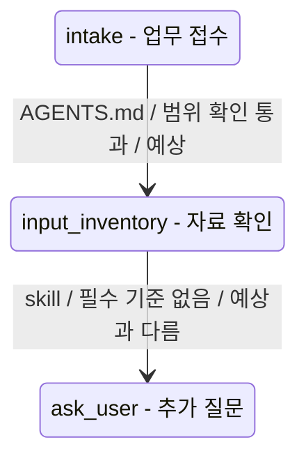

# 에이전트 하네스 부품별 명세 템플릿

> 사용법: 각 표의 빈칸을 채웁니다. **칸이 비면 그 자리가 설계 결함의 후보입니다.**
> 특히 "실패 모드"와 "불변식"이 비어 있으면 직관 설계가 빠뜨린 부분입니다.
> 불변식은 구현과 무관하게 항상 참이어야 하는 규칙이며, 그대로 테스트 기준이 됩니다.

부품은 네 축으로 나뉩니다.

- **지시** (시스템 프롬프트, 입력 프롬프트): 무엇을 하는가
- **지식/상태** (메모리, skill): 무엇을 아는가
- **능력/행동** (MCP, 서브에이전트): 무엇을 할 수 있는가
- **제어/횡단** (hook): 언제 개입하는가

## 0. 번역 대상 작업 요약

| 항목 | 내용 |
|------|------|
| 작업 이름 | |
| 대상 사용자 | |
| 반복 빈도 | |
| 입력 자료 | |
| 기대 출력 | |
| 외부 서비스 | |
| 민감정보 여부 | |
| 사람 승인 지점 | |
| 맡지 않는 일 | |

---

## 0.5. 시나리오 준비도 판정

| 항목 | 내용 |
|------|------|
| 판정 | 충분 / 보완 필요 / 위험 / 차단 |
| 이유 | |
| 지금 만들 수 있는 workflow 범위 | |
| 지금 만들면 약한 workflow 단계 | |
| 사용자 설명 충분도 | 충분 / 설명 보완 필요 / 위험 / 지금은 설계 차단 |
| 요청 해석 줄글 | 사용자가 어떤 목적으로 적어준 것 같은지, 왜 이 상태로는 목적대로 작동하지 않을 수 있는지 상세히 설명 |
| 쉬운 설명 | 이 부분이 불분명해서 에이전트가 어떤 상황에 빠질 수 있는지 적습니다 |
| 먼저 확인해야 하는 질문 | |
| 사람 승인 없이는 막아야 할 행동 | |

---

## 1. 시스템 프롬프트 (지시 축 · 상수)

| 항목 | 내용 |
|------|------|
| 정체성/역할 | |
| 고정 제약 | |
| 불변식 (절대 위반 불가) | |
| 입력 (조립 시 들어오는 것) | |
| 출력 (다음 단계로 전달) | |
| 실패 모드 | 지시 모순 / 토큰 과다 / 정책 충돌 / 역할 범위 초과 |
| 버전·변경 관리 | |

---

## 2. 입력 프롬프트 (지시 축 · 변수)

| 항목 | 내용 |
|------|------|
| 이번 작업 목표 | |
| 가변 파라미터 | |
| 시스템 프롬프트와의 경계 (무엇이 변수인가) | |
| 불변식 | |
| 실패 모드 | 모호한 목표 / 시스템 제약과 충돌 / 필수 입력 누락 |
| 검증 규칙 (받기 전 체크) | |

---

## 3. 메모리 (지식 축 · 동적 상태)

| 항목 | 내용 |
|------|------|
| 기억 목적 | 다음 thread에서 무엇을 반복 설명하지 않기 위한 기억인가 |
| 기억 후보 | stable preference / recurring workflow / convention / known pitfall / 진행 상태 |
| 입력 | 이번 턴의 결과: 무엇을 알게 됐는가 |
| 출력 | 다음 턴 조립 시 선택적으로 주입될 상태 |
| source of truth와의 경계 | 항상 적용될 규칙은 `AGENTS.md`/checked-in docs, 보조 기억은 Codex memories |
| 저장 위치 | Codex 공식 memory는 `~/.codex/memories/`; repo에는 정책과 public-safe 샘플만 저장 |
| 저장 시점 | thread가 충분히 끝나고 idle 상태가 된 뒤 background로 생성될 수 있습니다. 즉시 저장된다고 가정하지 않습니다 |
| 사용 시점 | memory 사용이 켜져 있고 관련성이 높을 때 future session에 주입될 수 있음 |
| 수명/갱신 규칙 | 단기(작업 종료 시 폐기) vs 장기(세션 넘어 유지): 반드시 명시 |
| 저장 금지 | secrets / credentials / private originals / personal data / 검토 전 추정 |
| thread control | 사용자가 `/memories` 또는 Codex 앱 설정으로 사용/생성 여부를 조정 |
| 외부 context 정책 | MCP, web search, tool search 등 외부 context 사용 시 memory 생성 제외 여부 |
| 용량 초과 처리 | 무엇부터 버리는가 (오래됨 / 낮은 중요도 / 검토 안 됨 / 민감 가능성) |
| 선택 로직 (관련 메모리만 주입) | |
| 검토/삭제 | 공유 전 `~/.codex/memories/` 검토, 부적절한 기억은 삭제 또는 수정 |
| 실패 모드 | 잘못된 메모리 선택 / 오래된 기억 / 외부 context 오염 / 용량 초과 / 민감정보 포함 |
| 불변식 | 민감 정보(자격증명, 원문 문서, 개인정보 등)는 저장하지 않습니다 |

---

## 4. Skill (지식 축 · 정적 능력)

| 항목 | 내용 |
|------|------|
| 절차 내용 (무엇을 어떻게 하는가) | |
| 입력 (이 skill을 발동시키는 조건) | |
| 출력 (skill 적용 결과) | |
| 선택 로직 (언제 컨텍스트에 주입) | |
| 메모리와의 경계 (정적 절차 vs 동적 상태) | |
| 실패 모드 | 부적절한 발동 / 절차 내 단계 실패 / 오래된 절차 |
| 불변식 | |

---

## 5. MCP 도구 (능력 축 · 외부 인터페이스)

| 항목 | 내용 |
|------|------|
| 입력 | |
| 출력 | |
| 사전조건 | |
| 사후조건 | |
| 실패 모드 | 파일 없음 / 권한 없음 / 크기 초과 / 인증 실패 / API 제한 |
| 불변식 | 신뢰 경계 밖 자원은 어떤 경우에도 접근하지 않습니다 |
| 재시도 정책 | 최대 N회, 이후 에스컬레이션 |

---

## 6. 서브에이전트 (능력 축 · 재귀)

| 항목 | 내용 |
|------|------|
| 위임 범위 (어디까지 맡기는가) | |
| 부모→자식 컨텍스트 상속 (무엇을 물려주는가) | |
| 자식 메모리 격리 여부 (공유 vs 격리) | |
| 결과 검증 (어떻게 받아서 신뢰하는가) | |
| 재귀 한계 (무한 위임 방지) | 최대 깊이 N |
| 입력 / 출력 | |
| 실패 모드 | 컨텍스트 누수 / 무한 위임 / 자식 실패의 부모 전파 |
| 불변식 | |

---

## 7. Hook (제어 축 · 횡단 관심사)

| 항목 | 내용 |
|------|------|
| 트리거 지점 (제어 흐름의 어디) | 예: 도구 실행 직전 / 결과물 전달 직전 / 응답 직후 |
| 트리거 조건 (무슨 경우에) | |
| 동작 (가드인가, 점검인가, 액션인가) | |
| 입력 / 출력 | |
| 흐름에 미치는 영향 (차단 가능한가) | |
| 실패 모드 | hook 자체 실패 시 흐름은? (통과 / 중단 / 승인 요청) |
| 불변식 | |

결과물 검토 hook은 검토표, 보고서, 제안서, 제출서류 묶음처럼 사용자가 그대로 활용할 수 있는 산출물 앞에도 둡니다.

- 확인 기준: 근거 누락, 형식 오류, 확정 표현, 민감정보 포함 여부
- 반환 결과: `통과`, `수정 필요`, `사람 검토 필요`, `차단`
- 실패 시 흐름: 검토되지 않은 결과물을 최종본처럼 전달하지 않고 초안 수정 또는 사람 검토로 되돌립니다.

---

## 8. Workflow 상태 검증

| 상태 | 입력 | 출력 | 다음 상태 | 전이 조건 | 부족 정보 | 부족하면 생기는 문제 |
|------|------|------|-----------|-----------|-----------|----------------------|
| intake | | | scope_check | | | |
| scope_check | | | input_inventory | | | |
| input_inventory | | | plan | | | |
| plan | | | draft | | | |
| draft | | | validate | | | |
| validate | | | approval | | | |
| approval | | | deliver | | | |
| deliver | | | remember_or_close | | | |
| remember_or_close | | | close | | | |

전이 검증 규칙:

- 전이 조건이 비어 있으면 다음 상태로 넘어갈 근거가 없습니다.
- 부족 정보가 있으면 “그래서 어떤 문제가 생기는지”를 함께 적습니다.
- 위험 전이에는 hook 또는 사람 승인 정책이 있어야 합니다.
- 외부 서비스 전이에는 MCP 권한 경계와 dry-run 기본값이 있어야 합니다.
- 반복 절차 전이에는 skill 후보가 있는지 확인합니다.
- 다음 작업으로 이어지는 상태에는 memory 후보와 저장 금지 기준이 있어야 합니다.

---

## 8.5. 상태전이 다이어그램

Mermaid는 `stateDiagram-v2`를 사용합니다. 요구사항 디테일이 부족해도 대략적인 다이어그램은 먼저 그리고, 확실하지 않은 전이는 `보완 필요`, `위험`, `차단`, `예상과 다름`으로 표시합니다.

다이어그램 앞에는 아래 설명을 붙입니다.

- 상자는 에이전트가 잠시 머무는 상태입니다.
- 화살표는 다음 상태로 넘어가는 길입니다.
- 화살표 라벨은 `작동 부품 / 전이 이유 / 판정` 순서로 읽습니다.
- 라벨 하나를 자연어로 풀어 읽는 예시를 붙입니다. 예를 들어 `input_inventory -> ask_user: skill / 필수 자료 없음 / 예상과 다름`은 “자료 확인 단계에서 필수 자료가 없어서 skill이 추가 질문 상태로 돌려보낸다”는 뜻입니다.
- 먼저 볼 곳은 `예상과 다름`, `보완 필요`, `위험`, `차단` 전이입니다.
- 색상 판정은 `예상`, `보완 필요`, `위험`이 각각 어떤 정도의 주의가 필요한지 짧게 설명합니다.

| 전이 | 작동 부품 | 전이 조건 | 판정 | 사용자 예상 | 실제 설계 흐름 | 부족 정보 |
|------|-----------|-----------|------|-------------|----------------|-----------|
| intake -> scope_check | `AGENTS.md` | | 예상 / 보완 필요 / 위험 / 차단 / 예상과 다름 | | | |
| scope_check -> input_inventory | skill / MCP / hook / memory / subagent / `.codex.toml` | | | | | |

Mermaid 예시:



---

## 9. 부족 정보와 보강 계획

| 부족한 정보 | 약해지는 상태/전이 | 에이전트가 빠질 수 있는 상황 | 사용자에게 생길 문제 | 보강할 부품 | 보강 방식 | 먼저 물어볼 질문 |
|-------------|-------------------|------------------------------|----------------------|-------------|-----------|------------------|
| | | | | `AGENTS.md` / skill / MCP / hook / memory / subagent / `.codex.toml` | | |

사용자에게 설명할 때는 아래 순서로 적습니다.

```text
이 부분이 불분명합니다.
그래서 에이전트가 이런 상황에 빠질 수 있습니다.
그래서 이런 hook이 추가되면 좋을 것 같아요.
이 부분은 skill로 만들어서 AGENTS.md에 사용 규칙을 추가하면 좋을 것 같아요.
또는 00번 에이전트가 사용자에게 이런 정보를 더 받아야 합니다.
```

보강 판정 기준:

- 맡을 일과 맡지 않을 일이 흐리면 `AGENTS.md` Mission, Non-goals, Operating Rules를 보강합니다.
- 반복 절차가 흐리면 skill 후보를 보강합니다.
- 외부 서비스 접근이 흐리면 MCP 입력/출력, 권한, dry-run, 실패 정책을 보강합니다.
- 위험 행동이 있으면 hook 승인, 차단, 감사 정책을 보강합니다.
- 결과물을 사용자에게 전달하기 전에 검토가 필요하면 hook 자동 체크포인트를 보강합니다. 근거 누락, 형식 오류, 확정 표현, 민감정보 포함 여부를 확인하고 `통과`, `수정 필요`, `사람 검토 필요`, `차단`으로 나눕니다.
- 다음 작업에 이어질 결정이나 선호가 있으면 memory 계약을 보강합니다.
- 병렬 조사나 독립 검토가 필요하면 subagent 위임 범위와 결과 검증을 보강합니다.
- 출력 형식과 품질 기준이 흐리면 `.codex.toml` outputs, formats, validation을 보강합니다.

도구 판정 기준:

- 서비스명이나 내부 약칭의 뜻을 모르면 도구를 고르기 전에 정의 요청 질문을 먼저 씁니다.
- 사용할 도구는 `사용`, `보류`, `제외` 중 하나로 표시하고 이유를 붙입니다.
- 외부 서비스 조작은 서비스 정의, 계정/권한, 실제 조작 범위, dry-run 가능 여부가 정해지기 전까지 보류합니다.
- 파일이나 문서 도구는 자료 형식, 접근 승인, 개인정보 포함 여부가 정해진 뒤에만 후보로 둡니다.

---

## 10. 산출물 초안

| 산출물 | 내용 |
|--------|------|
| `AGENTS.md`에 들어갈 핵심 규칙 | |
| `.codex.toml`에 들어갈 핵심 설정 | |
| workflow 상태 모델 | |
| 사용자 설명 충분도 진단 | |
| 부족 정보 영향 보고 | |
| 불분명한 정보와 도구 판정 | |
| 하네스 부품 보강 계획 | |
| 만들 skill 후보 | |
| 만들 MCP 도구 후보 | |
| 만들 hook 후보 | |
| 만들 subagent 후보 | |
| 만들 memory 후보 | |
| 테스트 가능한 불변식 | |
| 구현 전 질문 | |

---

## 작성 순서 권장

1. **불변식부터** 전 부품에 대해 먼저 적습니다. 구현 전에 "절대 규칙"을 고정합니다.
2. 메모리는 공식 Codex memory, `AGENTS.md`, checked-in docs 중 어디에 속하는지 먼저 나눕니다.
3. workflow 상태 모델을 먼저 채웁니다. 상태와 전이가 비면 어떤 부품을 만들어도 실제 흐름이 흔들립니다.
4. 입력/출력을 채워 부품 간 연결이 맞물리는지 봅니다. 한 부품의 출력은 다음 부품의 입력이 되어야 합니다.
5. **실패 모드를 채우며 빈칸을 찾습니다.** 여기가 직관이 빠뜨린 지점입니다.
6. 부족 정보가 있으면 사용자에게 생길 문제와 보강할 하네스 부품을 함께 적습니다.
7. 채운 표를 제어 흐름 다이어그램과 대조해, 모든 전이에 대응하는 명세가 있는지 확인합니다.
