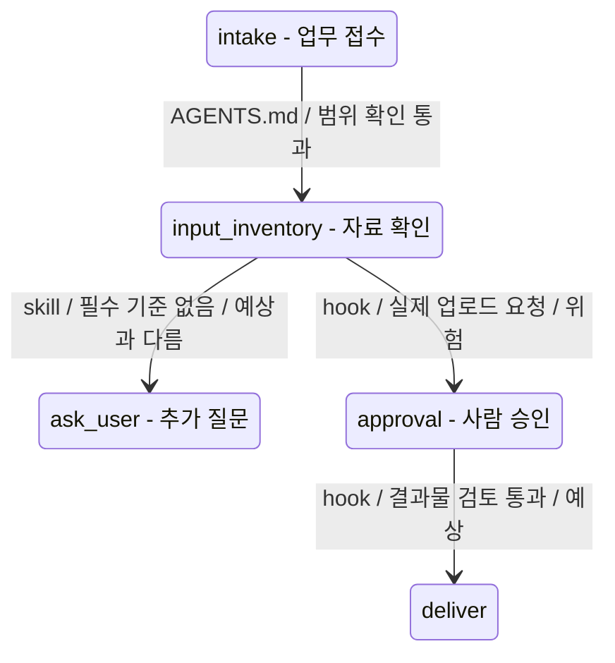

# Workflow 상태 검증 가이드

이 문서는 0번 에이전트 하네스 번역기가 사용자의 업무 시나리오를 에이전트 workflow로 바꿀 때 사용하는 검증 기준입니다.

쉽게 말해 이 문서는 “지금 받은 설명만으로 에이전트가 기대한 순서대로 일할 수 있을까요?”를 확인하는 검사표입니다. 0번 에이전트는 사용자가 준 정보가 부족하면 억지로 설계를 완성하지 않고, 어떤 정보가 부족해서 workflow가 흔들리는지 알려야 합니다.

이 에이전트는 사용자가 “이 정도면 내 업무 설명이 충분하겠지?”라고 생각하는 지점을 대신 점검합니다. 답변은 비개발자 사회인이나 대학생도 이해할 수 있도록 파인만 학습법처럼 쉬운 말로 설명합니다.

## 검증 목표

0번 에이전트는 하네스 명세를 만들기 전에 아래 세 가지를 먼저 확인합니다.

1. 업무가 어떤 상태를 거쳐 진행되는지 보입니다.
2. 각 상태 사이를 넘어가는 조건이 충분히 설명되어 있습니다.
3. 부족한 정보가 hook, skill, MCP, `AGENTS.md`, `.codex.toml`, memory 중 어디를 약하게 만드는지 설명합니다.
4. 정의되지 않은 외부 서비스명, 내부 약칭, 자료 출처, 도구 후보가 있으면 먼저 정의 요청 질문과 도구 사용 보류 조건을 표시합니다.

상태전이 다이어그램은 이 검증의 핵심 산출물입니다. 단순한 진행 순서 그림이 아니라, “어떤 조건 때문에 다음 상태로 넘어가는지”와 “어떤 하네스 부품이 그 전이를 만들거나 막는지”를 보여야 합니다.

## 상태 모델 기본형

아래 상태는 대부분의 업무 에이전트에 적용할 수 있는 기본 흐름입니다. 실제 업무에 맞지 않는 상태는 제외해도 되지만, 제외 이유를 적습니다.

| 상태 | 쉬운 설명 | 확인할 정보 |
|------|-----------|-------------|
| `intake` | 사용자가 일을 맡깁니다. | 누가, 어떤 목적으로, 어떤 자료를 주는지 |
| `scope_check` | 맡을 일과 맡지 않을 일을 가릅니다. | 자동화 범위, 금지 작업, 최종 책임자 |
| `input_inventory` | 필요한 자료가 있는지 확인합니다. | 필수 입력, 선택 입력, 민감 입력, 샘플 가능 여부 |
| `plan` | 작업 순서를 만듭니다. | 단계, 분기 조건, 반복 여부, 중단 조건 |
| `draft` | 초안을 만듭니다. | 산출물 형식, 품질 기준, 참고 자료 |
| `validate` | 초안을 검토합니다. | 검토 기준, 오류 판정, 근거 확인 방식, 결과물 자동 체크포인트 |
| `approval` | 사람이 승인할 지점을 둡니다. | 발송, 업로드, 제출, 크롤링, 로그인 사용 여부 |
| `deliver` | 결과를 전달합니다. | 파일 형식, 저장 위치, 사용자가 보는 요약 |
| `remember_or_close` | 기억할 것과 버릴 것을 나눕니다. | memory 후보, 저장 금지, 다음 작업 연결 |

## 전이 검증

상태 사이에는 “언제 다음 단계로 넘어가도 되는가”가 있어야 합니다.

| 전이 | 필요한 조건 | 부족하면 생기는 문제 |
|------|-------------|----------------------|
| `intake -> scope_check` | 사용자의 목표와 기대 출력이 분명합니다. | 에이전트가 엉뚱한 일을 맡을 수 있습니다. |
| `scope_check -> input_inventory` | 자동화할 범위와 금지할 범위가 분리되어 있습니다. | 위험한 외부 행동을 설계에 넣을 수 있습니다. |
| `input_inventory -> plan` | 필수 자료와 없을 때의 대체 흐름이 있습니다. | 자료가 없을 때 멈추지 않고 추측할 수 있습니다. |
| `plan -> draft` | 작업 순서와 분기 조건이 있습니다. | workflow가 사용자의 실제 업무 순서와 달라질 수 있습니다. |
| `draft -> validate` | 검토 기준과 실패 판정 기준, 결과물 자동 체크포인트가 있습니다. | 초안 품질을 확인하지 못하고 검토되지 않은 결과물이 전달될 수 있습니다. |
| `validate -> approval` | 사람 승인이 필요한 위험 행동이 표시되어 있습니다. | 승인 없이 발송, 업로드, 제출을 설계할 수 있습니다. |
| `approval -> deliver` | 승인 이후 산출물 전달 방식이 정해져 있습니다. | 결과 파일이 어디에 어떤 형식으로 나오는지 불명확합니다. |
| `deliver -> remember_or_close` | 다음 작업에 남길 정보와 버릴 정보가 나뉩니다. | memory에 민감정보가 들어가거나 필요한 상태가 사라질 수 있습니다. |

## 상태전이 다이어그램 규칙

0번 에이전트는 정보가 부족한 상황에서도 대략적인 상태전이 다이어그램을 그립니다. 단, 확실하지 않은 전이는 확실한 것처럼 보이면 안 됩니다.

- Mermaid는 `stateDiagram-v2`를 기본으로 사용합니다.
- 부족한 개발 요청은 부족한 상태 그대로 다룹니다. 사용자가 말하지 않은 기간 목표나 수업 단계 제한을 임의로 붙이지 않습니다.
- 각 화살표에는 전이를 만드는 조건과 하네스 부품을 함께 적습니다.
- 반복 절차로 넘어가는 전이는 skill로 표시합니다.
- 외부 서비스나 파일 접근으로 넘어가는 전이는 MCP로 표시합니다.
- 사람 승인, 차단, 감사, 결과물 검토 체크포인트가 필요한 전이는 hook으로 표시합니다.
- 맡을 일과 맡지 않을 일을 가르는 전이는 `AGENTS.md`로 표시합니다.
- 출력 형식이나 검증 기준 때문에 갈라지는 전이는 `.codex.toml`로 표시합니다.
- 다음 작업에 남길 상태를 다루는 전이는 memory로 표시합니다.
- 독립 검토나 병렬 조사가 필요한 전이는 subagent로 표시합니다.
- 사용자의 예상과 다르게 흘러가는 전이는 `예상과 다름`으로 표시하고, 왜 그렇게 흐르는지 쉬운 말로 설명합니다.
- 다이어그램 앞에는 상자, 화살표, 화살표 라벨, 색상 판정을 읽는 법을 붙입니다.
- 화살표 라벨 하나를 자연어 문장으로 풀어주는 예시를 반드시 넣습니다.

예:



이 예시에서 사용자는 자료를 주면 바로 검토가 시작될 것이라고 예상할 수 있습니다. 하지만 필수 기준이 없으면 에이전트는 `ask_user` 상태로 빠집니다. 실제 업로드 요청이 있으면 `hook`이 개입해 `approval` 상태로 보냅니다. 결과물을 전달하기 전에도 `hook`이 근거, 형식, 민감정보, 확정 표현을 확인하는 자동 체크포인트로 작동할 수 있습니다.

## 전이 라벨 형식

전이 라벨은 아래 정보를 짧게 포함합니다.

```text
하네스 부품 / 전이 조건 / 판정
```

예:

```text
skill / 필수서류 기준표 있음 / 예상
hook / 외부 제출 요청 / 차단
hook / 결과물 근거 점검 / 보완 필요
MCP / 로컬 파일 접근 dry-run / 보완 필요
```

전이 해석 표에는 아래 항목을 함께 적습니다.

| 항목 | 설명 |
|------|------|
| 전이 | 어느 상태에서 어느 상태로 넘어가는지 |
| 사용자 예상 | 사용자가 기대했을 가능성이 큰 흐름 |
| 실제 설계 흐름 | 에이전트가 실제로 가야 하는 상태 |
| 작동 부품 | skill, hook, MCP, `AGENTS.md`, memory, subagent, `.codex.toml` 중 무엇인지 |
| 이유 | 왜 그 전이가 필요한지 |
| 부족 정보 | 무엇이 부족해서 전이가 약한지 |

## 부족 정보 판정

0번 에이전트는 부족 정보를 아래 네 단계로 표시합니다.

| 판정 | 의미 | 0번 에이전트의 행동 |
|------|------|--------------------|
| `충분` | 지금 정보로 초안 workflow를 만들 수 있습니다. | 명세를 작성합니다. |
| `보완 필요` | 초안은 가능하지만 품질이나 분기 처리가 약합니다. | 가정을 표시하고 질문을 남깁니다. |
| `위험` | 승인, 민감정보, 외부 서비스 경계가 불분명합니다. | 해당 부분은 dry-run 또는 사람 승인으로 제한합니다. |
| `차단` | 필수 입력이나 금지 범위가 없어 workflow를 만들 수 없습니다. | 구현 초안 대신 질문 목록을 먼저 냅니다. |

부족 정보는 “무엇이 비어 있습니다”에서 멈추지 않습니다. 반드시 “그래서 workflow의 어느 부분이 기대만큼 나오지 않을 수 있습니다”까지 설명합니다.

설명은 아래 문장 구조를 따릅니다.

```text
이 부분이 불분명합니다.
그래서 에이전트가 이런 상황에 빠질 수 있습니다.
그래서 이런 hook이 추가되면 좋을 것 같아요.
이 부분은 skill로 만들어서 AGENTS.md에 사용 규칙을 추가하면 좋을 것 같아요.
또는 00번 에이전트가 사용자에게 이런 정보를 더 받아야 합니다.
```

예:

```text
검토 기준이 불분명합니다.
그래서 에이전트가 초안을 만들고도 좋은 결과인지 판단하지 못할 수 있습니다.
이 부분은 skill에 검토 순서를 넣고, hook에 사람 승인 지점을 두면 보강됩니다.
```

## 부품별 보강 기준

부족 정보가 발견되면 어느 하네스 부품을 보강해야 하는지 연결합니다.

| 부족한 정보 | 약해지는 부품 | 보강 방식 |
|-------------|---------------|-----------|
| 에이전트가 맡을 일과 맡지 않을 일이 흐립니다. | `AGENTS.md` | Mission, Non-goals, Operating Rules를 보강합니다. |
| 매번 같은 절차가 반복되지만 순서가 불명확합니다. | skill | 반복 절차를 단계별 skill 후보로 분리합니다. |
| 외부 서비스, 파일, 브라우저, API가 필요하지만 권한 경계가 없습니다. | MCP | 입력/출력 schema, 권한, dry-run, 실패 정책을 적습니다. |
| 외부 서비스명이나 내부 약칭의 뜻을 알 수 없습니다. | input prompt, MCP, hook | 서비스 정의, 사용 범위, 계정/권한, 실제 조작 여부를 먼저 질문하고 도구 선택을 보류합니다. |
| 발송, 업로드, 제출, 크롤링, 로그인 사용이 있습니다. | hook | 실행 전 승인, 민감정보 검사, 차단 정책을 둡니다. |
| 결과물의 근거, 형식, 표현, 민감정보 여부를 검토해야 합니다. | hook | 전달 전 자동 체크포인트를 두고 `통과`, `수정 필요`, `사람 검토 필요`, `차단`으로 나눕니다. |
| 다음 작업에 이어져야 하는 결정이나 선호가 있습니다. | memory | 저장 목적, 저장 금지, 저장 위치, 수명, 삭제 방법을 적습니다. |
| 병렬 조사나 독립 검토가 필요합니다. | subagent | 위임 범위, 전달할 최소 컨텍스트, 결과 검증 기준을 둡니다. |
| 출력 형식과 품질 기준이 모호합니다. | `.codex.toml`, `AGENTS.md` | outputs, formats, validation, human review를 보강합니다. |

## 쉬운 설명 기준

0번 에이전트는 사용자가 기술 용어를 몰라도 이해할 수 있게 설명합니다.

- `workflow 전이`라고만 말하지 않고 “다음 단계로 넘어가는 기준”이라고 풀어 말합니다.
- `hook`이라고만 말하지 않고 “위험한 행동이나 결과물 전달 전에 잠깐 멈춰 확인하는 자동 체크포인트”라고 풀어 말합니다.
- `MCP`라고만 말하지 않고 “외부 서비스나 파일을 안전하게 다루는 연결 장치”라고 풀어 말합니다.
- `skill`이라고만 말하지 않고 “반복되는 작업 순서를 적어 둔 조리법”이라고 풀어 말합니다.
- `AGENTS.md`라고만 말하지 않고 “에이전트가 항상 지켜야 하는 업무 규칙표”라고 풀어 말합니다.

## 사용자에게 알려야 하는 형식

0번 에이전트는 검증 결과를 아래 형식으로 설명합니다.

```text
현재 시나리오는 초안 작성까지는 가능하지만, 검토 단계가 약합니다.

부족한 정보:
- 평가 기준이 없습니다. 그래서 draft -> validate 전이에서 초안이 좋은지 판단하기 어렵습니다.
- 최종 제출 여부가 불명확합니다. 그래서 approval hook을 어디에 둘지 정하기 어렵습니다.

보강할 하네스 부품:
- AGENTS.md: 맡지 않는 일에 "최종 제출 자동화 제외"를 넣습니다.
- skill: 평가기준 대응표 작성 절차를 skill 후보로 둡니다.
- hook: 외부 제출 또는 파일 업로드 전 사람 승인을 두고, 결과물 전달 전 근거와 표현을 자동 점검합니다.

먼저 확인할 질문:
1. 초안의 품질을 판단할 기준표가 있나요?
2. 이 에이전트가 최종 제출까지 하나요, 제출 전 검토표까지만 만드나요?
```

## 완료 기준

0번 에이전트는 아래 조건을 만족할 때만 하네스 명세 초안을 완료로 봅니다.

- 모든 핵심 상태에 입력, 출력, 다음 상태가 있습니다.
- 모든 위험 전이에 승인 또는 차단 정책이 있고, 결과물 전달 전 자동 검토 체크포인트가 있습니다.
- 모든 외부 서비스 후보에 dry-run 기본값과 권한 경계가 있습니다.
- 모든 부족 정보에 사용자 영향과 보강할 하네스 부품이 연결되어 있습니다.
- `AGENTS.md`, skill, MCP, hook, memory, subagent 중 어느 부품을 만들지와 만들지 않을지가 분리되어 있습니다.
- 구현 전 질문이 “궁금한 점”이 아니라 “이 답이 없으면 어느 workflow가 약해지는지”와 함께 적혀 있습니다.
